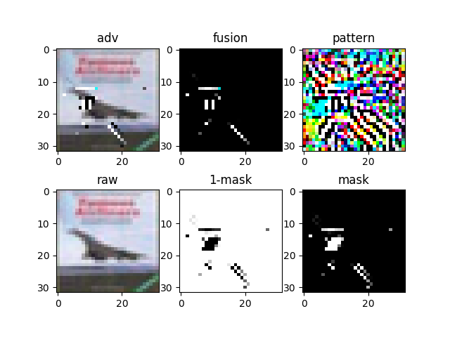
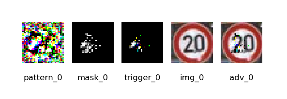
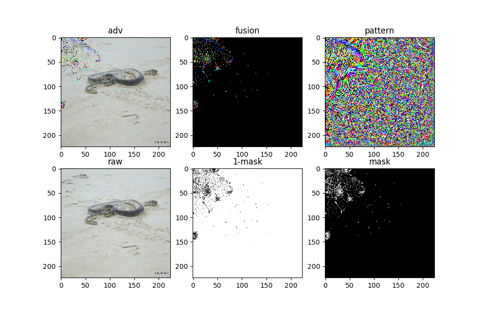

**This repository contains code for "SimpleFool: Simple universal adversarial noises to fool deep neural networks".**

Required python tool (under Ubuntu 16.04): Python 2.7, Keras (2.2.2), TensorFlow 1.9.0, numpy, opencv(3.4.1). 


# Structure

```
--SimpleFool--data
			  |--cifar10_train_5000.h5
			  |--cifar10_test_1000.h5
			  |--imagenet_train_224_10000.h5
			  |--imagenet_val_224_50000.h5
			  |--......
			--models
			  |--cifar10_clean.h5py
			  |--gtsrb.h5py
			  |--incepton_v3_weights_tf_dim_ordering_tf_kernels.h5
			  |--......
			--results  
			  |--cifar10
			     |--cifar10_UAN_fusion_target_X.png    #fusion is mask*pattern
			     |--cifar10_UAN_mask_target_X.png      #X is the target class
			     |--cifar10_UAN_pattern_target_X.png
			     |--......
			  |--imagenet
			     |--......
			  |--gtsrb
			     |--.....
			--adv   #stored images with UAN (ie, adversarial examples)

			--simplefool.py   #load data, generating universal adversarial noises
			--visualizer.py   #setting objective function, solve pattern and mask
			--test_cifar10.py   #test the universal adversarial attack on cifar10 task
			--parameters.py
			--utils_simplefool.py
			--result.txt
```


# Data

We put the cifar10, gtsrb, and imagenet dataset in h5py files, respectively.

**All the dataset and models can be downloaded from [Google drive](https://drive.google.com/drive/folders/1KQt9gAasIhdHqTdnruXdvJ1qihr18Nsn?usp=sharing).**

**CIFAR10：**

cifar10_train_5000.h5    #10 classes, each class contains 5000 images in order.

cifar10_test_1000.h5    #10 classes, each class contains 1000 images in order.

**GTSRB：**

gtsrb_train_sum.h5   #

gtsrb_test_sum.h5   #

**IMAGENET**：

imagenet_train_224_10000.h5     #1000 imagenet class, each class contains 10 images.

imagenet_val_224_50000.h5         #ILSVRC 2012 validation set


# Code Usage

**Run simplefool.py directly.**  The default setting is the targeted universal adversarial noises for the CIFAR-10 task. Each class label was regarded as target label in turn.

**Run test_cifar10.py directly**  to evaluate the targeted attack on cifar10 task.

Change visualizer.py to set nontargeted attack.


# Result





